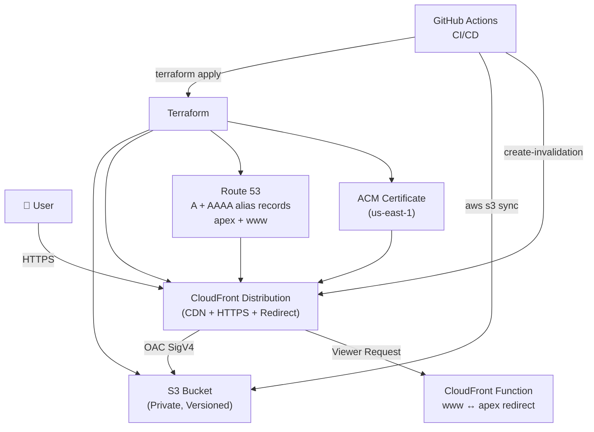

# Static Site AWS Deployment Pipeline

Production-ready deployment pipeline for a static/SPA site on AWS using Terraform and GitHub Actions.



## Architecture

| Component | Purpose |
|-----------|---------|
| S3 | Private static asset storage |
| CloudFront | CDN, HTTPS termination, SPA routing, www↔apex redirect |
| ACM | TLS certificate (must be in us-east-1 for CloudFront) |
| Route 53 | DNS — A + AAAA alias records for apex and www |
| CloudFront OAC | Secure S3 access without public bucket |
| CloudFront Function | 301 redirect between www and apex |
| GitHub Actions | CI/CD — build → terraform → sync → invalidate |

## Prerequisites

1. AWS account with Route 53 hosted zone for your domain
2. GitHub repository with Actions enabled
3. Terraform >= 1.5.0 installed locally
4. AWS CLI configured locally for first-time setup

## Repository Structure

```
.
├── .github/
│   └── workflows/
│       └── deploy.yml          # CI/CD pipeline
├── terraform/
│   ├── providers.tf            # AWS provider config
│   ├── main.tf                 # All infrastructure resources
│   ├── variables.tf            # Input variables
│   ├── outputs.tf              # Output values
│   ├── dev.tfvars              # Dev environment values
│   ├── prod.tfvars             # Prod environment values
│   ├── iam-github-actions-policy.json   # IAM policy for deploy role
│   └── iam-oidc-trust-policy.json       # OIDC trust policy for GitHub Actions
├── src/                        # Your site source
├── dist/                       # Build output (gitignored)
└── README.md
```

## First-Time Setup

### 1. Create the GitHub Actions IAM Role (OIDC — no long-lived keys)

```bash
# Create the OIDC provider (once per AWS account)
aws iam create-open-id-connect-provider \
  --url https://token.actions.githubusercontent.com \
  --client-id-list sts.amazonaws.com \
  --thumbprint-list 6938fd4d98bab03faadb97b34396831e3780aea1

# Edit iam-oidc-trust-policy.json — replace YOUR_ACCOUNT_ID, YOUR_GITHUB_ORG, YOUR_REPO

# Create the role
aws iam create-role \
  --role-name github-actions-static-site-deploy \
  --assume-role-policy-document file://terraform/iam-oidc-trust-policy.json

# Attach the permissions policy
aws iam put-role-policy \
  --role-name github-actions-static-site-deploy \
  --policy-name StaticSiteDeployPolicy \
  --policy-document file://terraform/iam-github-actions-policy.json
```

### 2. Configure GitHub Secrets

Go to your repo → Settings → Secrets and variables → Actions, and add:

| Secret | Value |
|--------|-------|
| `AWS_DEPLOY_ROLE_ARN` | `arn:aws:iam::YOUR_ACCOUNT_ID:role/github-actions-static-site-deploy` |
| `AWS_REGION` | `ap-southeast-2` |
| `TF_VARS_FILE` | `prod.tfvars` (or `dev.tfvars`) |
| `BUILD_OUTPUT_DIR` | `dist` |

### 3. Update tfvars

Edit `terraform/prod.tfvars` and `terraform/dev.tfvars` with your actual domain names.

### 4. First Terraform Apply (local)

Run once locally to bootstrap infrastructure before the pipeline takes over:

```bash
cd terraform
terraform init
terraform apply -var-file="prod.tfvars"
```

### 5. DNS Cutover

After `terraform apply` completes:

1. Get the Route 53 nameservers from the output:
   ```bash
   terraform output nameservers
   ```
2. Log in to your domain registrar and update the nameservers to the values above.
3. Wait for DNS propagation (TTL-dependent, typically 15 min – 48 hours).
4. Verify with:
   ```bash
   dig +short NS yourdomain.com
   curl -I https://yourdomain.com
   ```

## Caching Strategy

| Path | Cache-Control | TTL |
|------|--------------|-----|
| `/assets/*` | `public, max-age=31536000, immutable` | 1 year |
| `*.js`, `*.css` | `public, max-age=31536000, immutable` | 1 year |
| `index.html` + everything else | `no-cache, no-store, must-revalidate` | 0 |

Vite (and most bundlers) content-hash asset filenames, so long-lived caching is safe for `/assets/*`.

## SPA Routing

CloudFront returns `index.html` with HTTP 200 for any 403 or 404 from S3. This means deep links like `/dashboard/settings` work correctly without server-side routing.

## CI/CD Workflow

Two GitHub Actions workflows handle the full lifecycle:

| Workflow | Trigger | What it does |
|----------|---------|-------------|
| `pr-plan.yml` | PR opened / updated | Runs `terraform plan`, posts output as a PR comment |
| `deploy.yml` | PR merged into `main` | Runs `terraform apply`, syncs S3, invalidates CloudFront |

Deployments only happen on merge — direct pushes to `main` do not trigger a deploy.

## Multi-Environment Usage

```bash
# Dev
terraform apply -var-file="dev.tfvars"

# Prod
terraform apply -var-file="prod.tfvars"
```

To deploy to dev from CI, change `TF_VARS_FILE` secret to `dev.tfvars` or use a separate workflow triggered on a `dev` branch.

## Rollback

### Option 1 — Re-sync a previous build

```bash
# List previous S3 object versions
aws s3api list-object-versions --bucket YOUR_BUCKET_NAME --prefix index.html

# Restore a specific version
aws s3api copy-object \
  --bucket YOUR_BUCKET_NAME \
  --copy-source "YOUR_BUCKET_NAME/index.html?versionId=PREVIOUS_VERSION_ID" \
  --key index.html

# Invalidate CloudFront
aws cloudfront create-invalidation \
  --distribution-id YOUR_CF_DISTRIBUTION_ID \
  --paths "/*"
```

### Option 2 — Revert via Git

```bash
git revert HEAD
git push origin main
# GitHub Actions will rebuild and redeploy automatically
```

## Troubleshooting

**403 Forbidden from CloudFront**
- Check the S3 bucket policy allows the CloudFront distribution ARN via OAC.
- Ensure the OAC is attached to the origin in the distribution config.
- Run `terraform apply` again to reconcile any drift.

**Certificate validation stuck**
- Confirm the Route 53 hosted zone nameservers match your registrar's NS records.
- ACM DNS validation records must be resolvable publicly.
- Check with: `dig CNAME _acme-challenge.yourdomain.com`

**www not redirecting to apex (or vice versa)**
- The CloudFront Function handles this at the viewer-request stage.
- Check the function is published and associated with the distribution's default cache behaviour.
- Test: `curl -I https://www.yourdomain.com` — should return `301` with `Location: https://yourdomain.com`.

**SPA deep links returning 403/404**
- Verify the `custom_error_response` blocks in the CloudFront distribution map 403 and 404 → `/index.html` with response code 200.

**Terraform state conflicts in CI**
- Enable the S3 remote backend in `providers.tf` and use DynamoDB for state locking.
- Never run `terraform apply` locally and in CI simultaneously.

**CloudFront changes are slow**
- Distribution updates can take 5–15 minutes to propagate globally.
- Use `aws cloudfront wait distribution-deployed --id YOUR_CF_ID` in scripts.
